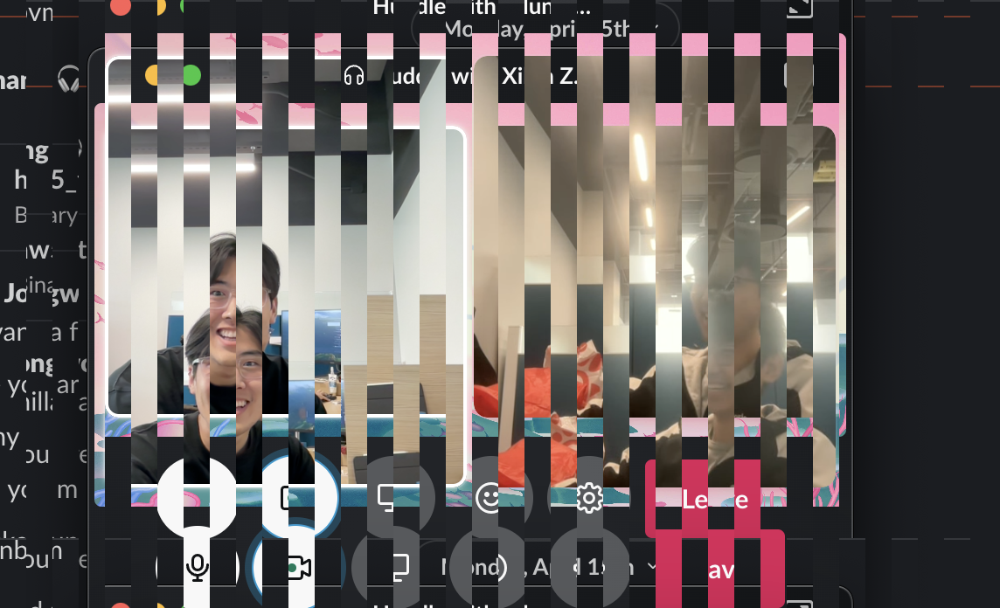
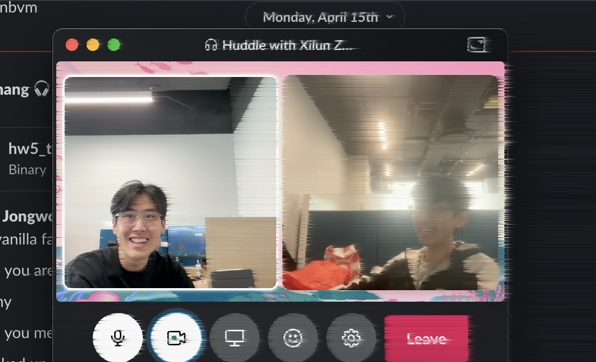
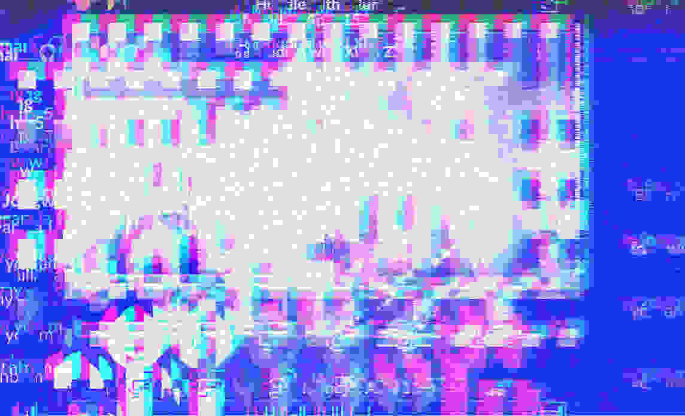

# glitch-rust

Implementation of [glitch](https://github.com/jpoz/glitch/tree/master?tab=readme-ov-file) in rust (originally in Go). Didn't implement all, just some that interested me.

Just for fun and playing around with image transformations.

## Usage
1. `git clone https://github.com/willxxy/glitch-rust.git`
2. `cd glitch-rust`
3. `cargo build`
4. `cargo run -- --file input.png --effect $EFFECT` where EFFECT={copy, transpose_input, vertical_transpose_input, channel_shift_left, channel_shift_right, half_life_right, prism_burst, noise, compression_ghost, all}.

## Examples

### copy:

### transpose_input:

### vertical_transpose_input:

### channel_shift_left:

### channel_shift_right:

### half_life_right:

### prism_burst:

### noise:

### compression_ghost:

### all:

